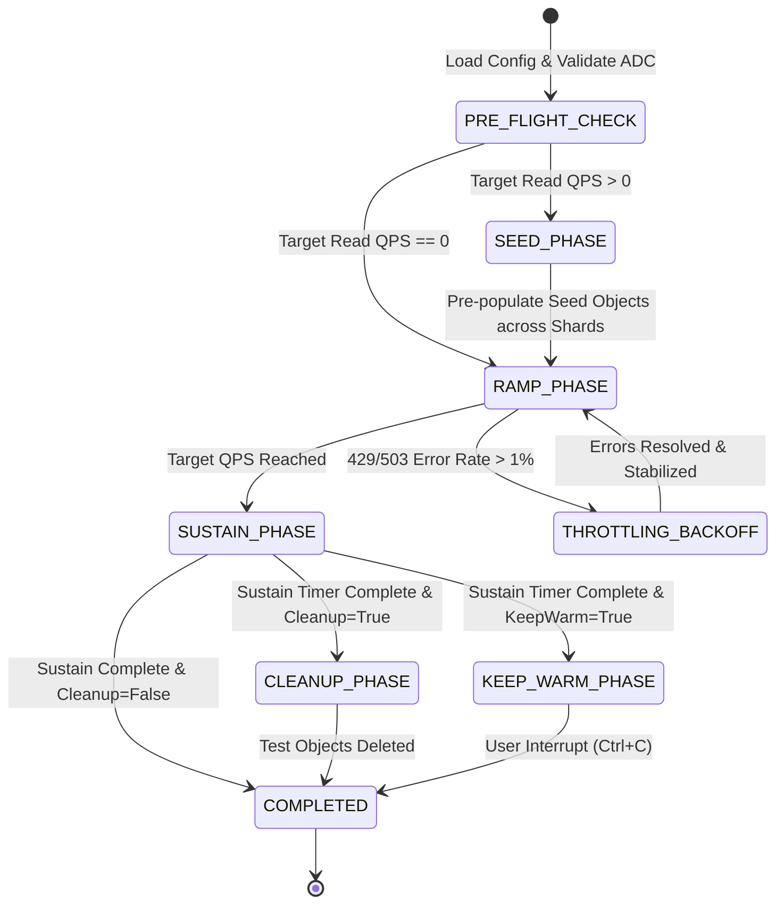

# Specification: GCS Bucket Pre-Warming & Pre-Splitting Tool (`GCSPreWarm`)

## 1. System Overview
`GCSPreWarm` is a Python-based utility engineered to pre-warm and pre-split Google Cloud Storage (GCS) buckets. GCS index partitions automatically scale up when traffic increases in a gradual, well-distributed manner across lexicographical key prefixes. This tool automates the ramp-up and partition splitting process so that applications can achieve a target Read and/or Write QPS without encountering `429 Too Many Requests` or `503 Service Unavailable` rate-limiting errors.

---

## 2. Configuration & Parameter Contract

### 2.1 User Environment Variables (`.env`)
| Variable | Type | Default | Description |
| :--- | :--- | :--- | :--- |
| `GCS_BUCKET_NAME` | `str` | *Required* | Name of the target GCS bucket. |
| `GCP_PROJECT_ID` | `str` | `""` | Optional GCP Project ID. |
| `TARGET_READ_QPS` | `int` | `0` | Desired read requests per second to achieve. |
| `TARGET_WRITE_QPS` | `int` | `1000` | Desired write requests per second to achieve. |
| `RAMP_DURATION_SECONDS`| `int` | `1200` | Duration (seconds) of the exponential ramp-up phase (default 20 min). |
| `SUSTAIN_DURATION_SECONDS`| `int` | `600` | Duration (seconds) to hold sustained target QPS. |
| `OBJECT_SIZE_BYTES` | `int` | `4096` | Payload size in bytes for dummy test objects (default 4KB). |
| `KEY_STRATEGY` | `str` | `"HEX"` | Key generation strategy: `HEX`, `ALPHANUMERIC`, `CUSTOM`. |
| `PREFIX_STRATEGY` | `str` | `"AUTO"` | Prefix depth: `AUTO`, `HEX_1`, `HEX_2`, `HEX_3`. |
| `CUSTOM_PREFIXES` | `str` | `""` | Comma-separated list of customer prefixes (e.g., `users/,orders/`). |
| `PREFIX_TEMPLATE` | `str` | `""` | Sequence template for prefixes (e.g., `tenant_{001..050}/`). |
| `KEY_PREFIX_BASE` | `str` | `"gcs_prewarm_test/"` | Base path/directory inside the bucket (e.g., `app_v1/` or `""` for root). |
| `CLEANUP_ON_FINISH` | `bool` | `true` | Asynchronously delete created test objects after completion. |
| `KEEP_WARM_MODE` | `bool` | `false` | Continue low-rate heartbeat traffic to maintain split shards. |

### 2.2 Centralized System Defaults (`src/config/settings.py`)
| Parameter | Type | Default | Description |
| :--- | :--- | :--- | :--- |
| `GCS_BASE_URL` | `str` | `https://storage.googleapis.com` | Base GCS REST/XML API endpoint. |
| `HTTP_MAX_CONNECTIONS`| `int` | `2000` | Max TCP connections in connection pool. |
| `HTTP_TIMEOUT_SECONDS`| `float`| `10.0` | Individual request timeout in seconds. |
| `HTTP_KEEP_ALIVE_SECONDS`| `float`| `60.0` | Keep-alive duration for TCP sockets. |
| `REPORT_INTERVAL_SECONDS`| `float`| `2.0` | Metrics reporting and console refresh interval. |
| `MAX_RETRIES` | `int` | `3` | Max retries for transient errors (429/503/network). |
| `BACKOFF_FACTOR` | `float`| `0.5` | Exponential backoff factor for retries. |
| `THROTTLING_ERROR_THRESHOLD`| `float`| `0.01` | Error rate (1%) triggering adaptive ramp backoff. |
| `STABILIZATION_COOLDOWN_SECONDS`| `int` | `60` | Cooldown period on throttling before resuming ramp. |
| `NUM_WORKERS` | `int` | `1` | Worker concurrency multiplier (auto-detected CPU cores). |

---

## 3. Core Algorithms & Math Specifications

### 3.1 Shard Requirement Calculation
GCS baseline capacities:
* Baseline Write QPS per partition: $C_w = 1,000$
* Baseline Read QPS per partition: $C_r = 5,000$
* Safety Headroom Factor: $S = 1.5$

$$\text{Required Shards} = \max\left(\left\lceil \frac{\text{TARGET\_WRITE\_QPS}}{C_w} \times S \right\rceil, \left\lceil \frac{\text{TARGET\_READ\_QPS}}{C_r} \times S \right\rceil, 1\right)$$

### 3.2 Key Prefix Partition Allocation
* **`HEX` Mode**:
  * Shards $\le 16 \rightarrow$ 1-hex depth (`0/`, `1/`, ..., `f/`) = 16 shards
  * Shards $\le 256 \rightarrow$ 2-hex depth (`00/`, `01/`, ..., `ff/`) = 256 shards
  * Shards $> 256 \rightarrow$ 3-hex depth (`000/`, `001/`, ..., `fff/`) = 4,096 shards
* **`ALPHANUMERIC` Mode**:
  * Set: `0-9`, `a-z`, `A-Z`, `-`, `_` (64 characters)
  * Shards $\le 64 \rightarrow$ 1-char depth (64 shards)
  * Shards $> 64 \rightarrow$ 2-char depth (4,096 shards)
* **`CUSTOM` Mode**:
  * Parsed from `CUSTOM_PREFIXES` or generated from `PREFIX_TEMPLATE` (e.g. `tenant_{001..100}/`).

### 3.3 Stepped Exponential Ramp-Up Curve
* **Initial Safe Rate**:
  * $R_0 = \min(\text{TARGET\_READ\_QPS}, 5000)$
  * $W_0 = \min(\text{TARGET\_WRITE\_QPS}, 1000)$
* **Step Count**: Calculated based on doubling steps:
  $$N_{\text{steps}} = \max\left(\left\lceil \log_2 \frac{\text{TARGET\_WRITE\_QPS}}{W_0} \right\rceil, \left\lceil \log_2 \frac{\text{TARGET\_READ\_QPS}}{R_0} \right\rceil, 1\right)$$
* **Step Duration**: $\Delta t = \frac{\text{RAMP\_DURATION\_SECONDS}}{N_{\text{steps}}}$
* **Rate at Step $k \in [0, N_{\text{steps}}-1]$**:
  $$W_k = \min(W_0 \times 2^k, \text{TARGET\_WRITE\_QPS})$$
  $$R_k = \min(R_0 \times 2^k, \text{TARGET\_READ\_QPS})$$

### 3.4 Adaptive Throttling Backoff Protocol
1. **Detection**: Metric window checks ratio of `(429_count + 503_count) / total_requests`.
2. **Threshold Violation (> 1%)**:
   * State changes to `THROTTLING_BACKOFF`.
   * Freeze ramp timer.
   * Drop current target QPS by 50% or down to previous step $W_{k-1}, R_{k-1}$.
   * Hold for `STABILIZATION_COOLDOWN_SECONDS` to allow GCS backend partition splits to settle.
3. **Recovery**: When error rate returns to $0\%$, resume ramp timer and transition back to `RAMPING`.

---

## 4. Execution Lifecycle

---

## 5. Security & Authentication Requirements
1. **Zero Secret Storage**: Never store service account keys in repository or configuration files.
2. **Standard GCP ADC**: Use `google.auth.default()` or direct GCP Instance Metadata Server queries.
3. **Token Management**: Thread-safe / async token caching with automatic proactive refresh before expiration.
